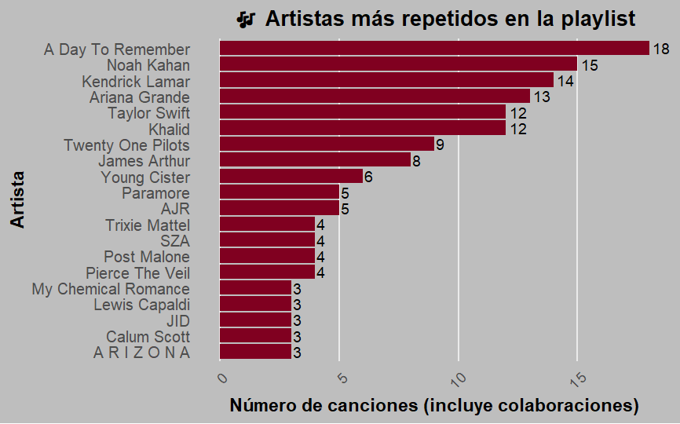

## Mi canción favorita

# Contexto

En el ramo de Medición y análisis dimensional de datos políticos nos dieron una tarea para mostrar nuestro aprendizaje en R. Como la tarea era de temática libre se me ocurrió determinar cual es mi canción favorita.

# Tarea 1:

Para esta tarea 1, voy a comenzar observando las características de mis canciones favoritas. Para su conocimiento, tengo una playlist de canciones que considero como favoritas, pero no la tengo ordenada bajo ningún parámetro.

Primero, cargaremos las librerías que utilizaré:

``` r
library(tidyverse)
library(ggplot2)
library(spotifyr)
library(dplyr)
library(purrr)
```

Para la configuración de la API de Spotify, es necesario tener una cuenta de desarrollador en Spotify y obtener las credenciales necesarias (Client ID y Client Secret). Una vez que tengas estas credenciales, puedes configurarlas en R de la siguiente manera:

``` r
Sys.setenv(SPOTIFY_CLIENT_ID = 'tu_client_id_aqui')
Sys.setenv(SPOTIFY_CLIENT_SECRET = 'tu_client_secret_aqui')
```

Luego, se autentica la sesión con el token de acceso:

``` r
access_token <- get_spotify_access_token()
```

Con esto, buscamos el ID de la playlist, en este caso, se puede obtener con el link de la playlist en Spotify.

``` r
playlist_id <- "pon el ID de tu playlist aquí"

# Para obtener las canciones

tracks <- get_playlist_tracks(playlist_id, limit = 100)

# Para obtener las restantes:
offset <- 0
limit <- 100
canciones <- data.frame()
repeat {
  batch <- get_playlist_tracks(playlist_id, limit = limit, offset = offset)
  if (nrow(batch) == 0) break
  canciones <- bind_rows(canciones, batch)
  offset <- offset + limit
}
#Finalmente las unimos:

canciones_final <- bind_rows(canciones2, canciones)
```

Ahora que tenemos todas las canciones, vamos a ver quienes son los top 20 artistas que más se repiten, para ello creamos una lista y un vector para poder hacer el gráfico:

``` r
lista_artistas <- map(tracks$track.artists, ~ .x$name)

vector_artistas <- unlist(lista_artistas)
```

Luego, creo una base para contar los artistas que se repiten

``` r
conteo_artistas <- data.frame(artista = vector_artistas) |> 
group_by(artista) |> 
summarise(canciones = n()) |> 
arrange(desc(canciones))
```

Ahora vamos a gráficar el top 10 de los artistas que más se repiten en mi playlist de canciones favoritas:

``` r
ggplot(conteo_artistas[1:20, ], aes(x = reorder(artista, canciones), y = canciones)) +
  geom_col(fill = "#800020") +  
  geom_text(aes(label = canciones), hjust = -0.2, size = 4, family = "Georgia") + # etiquetas de cantidad
  coord_flip() +
  labs(
    title = "🎶 Artistas más repetidos en la playlist",
    x = "Artista",
    y = "Número de canciones (incluye colaboraciones)"
  ) +
  theme_minimal(base_size = 14, base_family = "Georgia") +
  theme(
    plot.title = element_text(face = "bold", hjust = 0.5, size = 16),
    axis.text.x = element_text(angle = 45, hjust = 1, vjust = 1),
    axis.text.y = element_text(size = 12),
    axis.title = element_text(face = "bold"),
    panel.grid.minor = element_blank(),
    panel.grid.major.y = element_blank(),
    plot.background = element_rect(fill = "grey", color = NA)
  )
```
## Top 20 :o



En el gráfico podemos ver como A Day To Remember tiene la delantera con 18 canciones, lo cual tiene sentido porque son mi banda favorita desde los 10 años. Le sigue de cerca Noah Kahan y Kendrick, que han sido parte del soundtrack de mi vida desde que surgieron. Luego Ariana y Taylor reinas del pop y cierran bandas y artistas de mi epoca hardcore y mi era poplolita.
